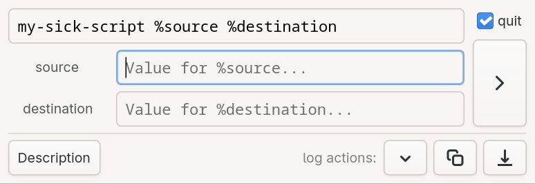

> for those of us who _don't_ live in terminal (yet)

## why shutton

I am a visual person. It is easier for me to navigate the digital side of my life in Thunar. I also use scripts. I want BUTTONS to launch my scripts. Yes, inside folders. No you're weird!

## how shutton



minimalist *(<1MB)* Rust app that presents a text input, runs a shell command, and shows/copies/filedrops output. Persists into itself, and can therefore be copy-pasted throughout your system and configured to do many useful things, in-place. Maybe even many copies inside the same folder. Go nuts.

## Usage

- copy the binary (see below) to where you want something executed from
- write a shell command (e.g. `chaffa %image`)
- fill in `%dynamic` `%variables` from the command
- decide if you want it to also quit on completion, or hang around
- **[Enter]** to run
- **[Esc]** to quit
- **[Ctrl]+[S]** to save

buttons/fields/toggles have tooltips.
on execution, the binary will auto-patch itself to memorize what was ran and how.
_(for extra smarts, drop the binary into your `Templates` folder!)_

---

## Install

dependencies: 
- [rust installed in your system](https://rust-lang.org/tools/install/)
- `GTK4` system libraries. On Fedora:
```sh
sudo dnf install gtk4-devel
```
_(have instructions for your repo? happy to add - make an issue with them!)_

build & install with cargo:
```sh
# navigate to where you build apps, for example, ~/Applications/Gits
git clone https://github.com/Taugeshtu/shutton
cd shutton
cargo build --release
# optionally:
cp target/release/shutton ~/Templates/
```

then drop the built `shutton` wherever you need it!

---

## Version history

*(as of v1.1.0 shutton is considered feature-complete; I don't expect adding/changing much of anything about it)*

v1.1.0
- [x] log output file now carries name from the binary

v1.0.0
- [x] pop policy-kit when encountering sudo requirement

v0.5.0
- [x] description text field, for more elaborate things
- [x] persisting state of unfold for description and logs
- [x] `ctrl+s` to save state
- [x] monospace command, arguments, and log fields
- [x] stripping ANSI extras for clean log

v0.4.2
- [x] also persisting window width (why not)
- [x] fixed variables parsing to instead extract `a1phanum3r1cs` and `_`

v0.4.0
- [x] persistence into the binary itself (main command, arguments, autoquit, window width)

v0.3.0
- [x] additional arguments fields

v0.2.0
- [x] log action buttons: view, copy, drop as file
- [x] quit-on-done toggle

v0.1.0
- [x] present GUI, run shell script
- [x] run shell script when hitting "Enter"
- [x] quiet-quit when hitting "Esc"
